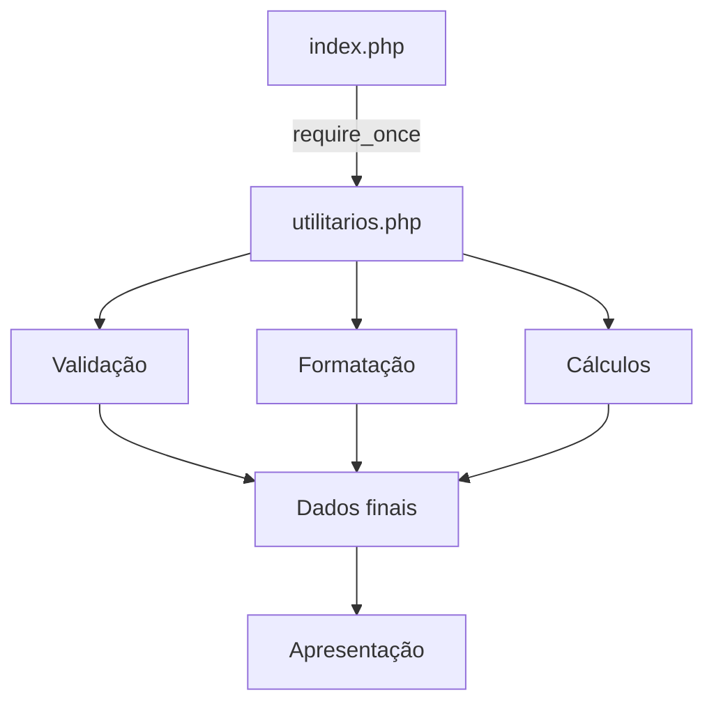

## SABP: Projeto: Central de Atendimento e Cadastro do CRM Senai

**Equipe:**

* Analista: Miguel Barbosa e Julia Guerra;

* Desenvolvedor da biblioteca: Felipe Scalfi;

* Desenvolvedor da interface: Julia Guerra;

* Testador e documentador: Felipe Scalfi e Julia Guerra.

## 1. Objetivo

O projeto tem como objetivo desenvolver uma aplicação web simples para centralizar o cadastro, organização, consulta e apresentação de informações de clientes, utilizando PHP.

A aplicação foi desenvolvida com foco na organização do código, reutilização de funções e separação entre a lógica de processamento dos dados e a apresentação das informações na interface.

**Para isso, o projeto é dividido principalmente em:**

utilitarios.php: biblioteca responsável pelas funções de processamento, validação, limpeza, formatação e cálculos;
index.php: responsável pela apresentação dos dados e interação com o usuário.

A proposta também aplica o princípio DRY (Don't Repeat Yourself), evitando a repetição de regras de negócio no código.

## 2. Contexto do problema

Uma empresa de serviços controla seus clientes por meio de planilhas, porém os dados encontram-se desorganizados e seguem diferentes padrões de preenchimento.

Entre os principais problemas identificados estão:

- nomes escritos com letras maiúsculas e minúsculas de forma inconsistente;
- espaços desnecessários nos nomes;
- CPFs armazenados com diferentes formatos;
- valores de contratos sem padronização;
- informações de clientes ativos e inativos;
- repetição de códigos responsáveis pelas mesmas operações;
- dificuldade para gerar informações resumidas sobre os contratos.

O sistema proposto busca solucionar esses problemas por meio de uma biblioteca de funções PHP reutilizável e de uma interface para visualização dos dados.

## 3. Levantamento de requisitos

O levantamento de requisitos foi realizado considerando as necessidades do sistema e as funcionalidades obrigatórias propostas para a atividade.

Os requisitos foram divididos em requisitos funcionais e requisitos não funcionais.

**3.1 Requisitos funcionais:**

Os requisitos funcionais descrevem o que o sistema deve fazer.

| ID | Requisito | Descrição / Critério de aceite | Prioridade |
|----|-----------|--------------------------------|------------|
| RF01 | Listagem de clientes | Percorre `$clientes` com `foreach` e exibe nome, CPF, e-mail, contrato (formatado) e situação. Todos os clientes devem aparecer, sem omissões. | Alta |
| RF02 | Busca por nome | Recebe um nome e retorna os dados do cliente via `buscarCliente()`. Se não existir, informa "cliente não encontrado". | Alta |
| RF03 | Cadastro de cliente | Insere/simula um novo cliente validando nome, e-mail, CPF e contrato. Só aceita se tudo for válido. | Alta |
| RF04 | Limpeza de dados | Remove espaços extras do nome (`trim`/`str_replace`) e pontuação do CPF, deixando só dígitos. | Média |
| RF05 | Formatação de saída | Nome padronizado e contrato em formato de moeda brasileira via `formatarMoeda()` (ex.: `R$ 1.500,00`). | Média |
| RF06 | Resumo financeiro | Soma os contratos apenas dos clientes ativos (`calcularTotalContratosAtivos`) e calcula a média geral. | Alta |
| RF07 | Reajuste por referência | `aplicarReajuste(&$contrato, $percentual)` altera o valor original do cliente via passagem por referência. | Alta |
| RF08 | Relatório final | Exibe total de clientes (`count`), total de ativos (`contarClientesAtivos`) e o maior contrato cadastrado. | Alta |

**3.2 Requisitos não funcionais** 
Os requisitos não funcionais definem como o sistema deve funcionar e quais características técnicas e de qualidade devem ser respeitadas.
tabela nf

| ID | Requisito | Descrição | Priodade |
|----|---------|---------|--------|
|RNF01|linguagem|O sistema deve ser desenvolvido utilizando PHP.|Alta|
|RNF02|Tipagem|Os arquivos PHP devem utilizar declare`(strict_types=1)`;.|Alta|
|RNF03|Código organizado|As funções de processamento devem ser separadas do código responsável pela apresentação.|Alta|
|RNF04|Reutilização|As regras de negócio devem ficar centralizadas em `utilitarios.php`, evitando duplicação de código.|Alta|
|RNF05|Manutenibilidade|O código deve possuir funções pequenas e específicas, facilitando futuras alterações.|Alta|
|RNF06|Legibilidade|Variáveis e funções devem possuir nomes claros e relacionados à sua finalidade.|Média|
|RNF07|Validação|Dados fornecidos ao sistema devem ser validados antes de serem utilizados.|Alta|
|RNF08|Interface|A interface deve apresentar as informações de forma organizada e compreensível para o usuário.|Média|
|RNF09|Compatibilidade|A aplicação deve funcionar em um ambiente com servidor PHP e navegador web.|Alta|
|RNF10|Desempenho|O sistema deve realizar as operações de consulta e cálculo de forma simples e rápida, considerando a quantidade de dados utilizada no projeto.|Média|
|RNF11|Segurança básica|Informações recebidas pelo sistema devem passar por validações antes do processamento.|Alta|
|RNF12|Manutenção|Alterações nas regras de negócio devem poder ser realizadas principalmente na biblioteca, sem necessidade de alterar várias partes da interface.|Alta|


## 4. Desenvolvimento da biblioteca
A biblioteca utilitarios.php concentra as principais regras de negócio do sistema. Sua criação tem como objetivo evitar que a mesma lógica seja escrita diversas vezes em diferentes partes da aplicação. A biblioteca segue o princípio DRY (Don't Repeat Yourself), centralizando funções de:

- limpeza de dados;
- formatação;
- validação;
- busca;
- cálculos financeiros;
- contagem de clientes;
- aplicação de reajustes.

Dessa maneira, caso uma regra precise ser alterada, o desenvolvedor pode modificar a função correspondente em um único local.

**4.1 Principais funções** 

`formatarNome()`

Responsável por limpar espaços desnecessários e padronizar o nome do cliente.

Exemplo:

>Entrada:
"  ANA CLARA SILVA  "

>Saída:
"Ana Clara Silva"

`limparCPF()`

Remove caracteres de formatação do CPF, mantendo somente os números.

**Exemplo:**

>Entrada:
123.456.789-00

>Saída:
12345678900

`validarCPF()`

Verifica se o CPF informado atende aos critérios definidos pelo sistema. A função possui retorno booleano: Assim, o sistema consegue identificar facilmente se o CPF é válido ou inválido.

`validarEmail()`

Verifica se o endereço de e-mail informado possui um formato válido.

Exemplo: 

>ana.clara@email.com

é considerado válido, enquanto:

>ana.clara#email

é considerado inválido.

`formatarMoeda()`

Converte valores numéricos para o padrão de moeda brasileira.

Exemplo:

> 1500.50 → R$ 1.500,50

Para isso, é utilizado o recurso:
```php
number_format()
buscarCliente()
```
Percorre a lista de clientes procurando um cliente pelo nome.

A função utiliza retorno:
```php
?array
```
Isso permite que a função retorne:

um array, quando o cliente é encontrado;
null, quando o cliente não existe.

Exemplo:
```php
$cliente = buscarCliente($clientes, "Ana Clara Silva");

if ($cliente === null) {
    echo "Cliente não encontrado";
}
calcularTotalContratosAtivos()
```
Percorre os clientes e soma somente os valores dos contratos daqueles que estão com a situação ativa.

Exemplo:

>Cliente 1: R$ 1.500,00 — ativo

>Cliente 2: R$ 850,50 — ativo

>Cliente 3: R$ 2.000,00 — inativo

**Total: R$ 2.350,50** 

`calcularMediaContratos()`

Calcula a média dos valores de contrato cadastrados. Essa função permite apresentar um resumo financeiro dos clientes.

`contarClientesAtivos()`

Percorre a lista de clientes e contabiliza somente aqueles cujo campo ativo possui valor true.

`aplicarReajuste()`

Aplica um percentual de reajuste ao contrato. 

A função utiliza passagem por referência:

`function aplicarReajuste(float &$contrato, float $percentual): void`

O uso de & permite que o valor original seja alterado.

Exemplo:

>Contrato original: R$ 1.000,00

> Reajuste: 10%

> Novo contrato: R$ 1.100,00

O retorno da função é void, pois a alteração é realizada diretamente na variável recebida por referência.

---

### Requisitos técnicos obrigatórios

- `declare(strict_types=1);` em todos os arquivos PHP
- Funções com parâmetros tipados e tipo de retorno explícito
- Ao menos uma função com retorno `void` (ex.: `aplicarReajuste`)
- Ao menos uma função `bool` (ex.: `validarCPF`) e uma `?array` (ex.: `buscarCliente`)
- Uso de `foreach` para percorrer os clientes
- Uso de `count()`, `strlen()`, `str_replace()`, `trim()` e `number_format()`
- Uso de `if` / `elseif` / `else` nas validações
- Uso de passagem por referência (`&`) para alterar valor original
- Uso de `require_once` para importar `utilitarios.php`
- Separação entre funções de processamento e código de apresentação

### Modelagem dos dados

Cada cliente é um array associativo com as chaves: `nome` (string), `cpf` (string, com ou sem pontuação), `email` (string), `contrato` (float) e `ativo` (bool).


### Pontos para a apresentação

- **Princípio DRY:** toda regra de negócio (limpeza, validação, cálculo, formatação) fica só em `utilitarios.php`; se mudar uma regra, muda em um único lugar.
- **Passagem por referência:** sem o `&`, `aplicarReajuste()` alteraria apenas uma cópia do contrato — o valor original no array `$clientes` não mudaria.
- **Retorno `?array` em `buscarCliente()`:** não encontrar um cliente é um resultado esperado, não um erro — retornar `null` permite checar com `if ($cliente === null)` sem tratamento de exceção.

## 5. Desenvolvimento da interface

A interface do projeto é desenvolvida no arquivo index.php.

Sua responsabilidade principal é apresentar as informações processadas pela biblioteca ao usuário, evitando concentrar as regras de negócio na camada visual. A interface apresenta os dados dos clientes de maneira organizada, permitindo visualizar informações como:

- nome;
- CPF;
- e-mail;
- valor do contrato;
- situação do cliente;
- quantidade total de clientes;
- quantidade de clientes ativos;
- maior contrato;
- informações financeiras.

**5.1 Organização da interface**

A tela principal pode ser dividida em três áreas principais:

- **Cabeçalho**

- **Apresenta a identificação do sistema:**

- **Central de Atendimento e Cadastro do CRM SENAI** 

- **Área de clientes**

- **Área de resumo**

Ao final da página são apresentadas informações resumidas, como:

- Total de clientes
- Clientes ativos
- Total dos contratos ativos
- Média dos contratos
- Maior contrato

## 6. Separação entre biblioteca e interface

O projeto utiliza uma separação entre a lógica de processamento e a apresentação.

A estrutura funciona da seguinte maneira:


O arquivo index.php é responsável principalmente pela interface, enquanto utilitarios.php contém as funções responsáveis pelo processamento.

Essa divisão facilita a manutenção e permite reutilizar as funções em outras páginas.

## 10. Requisitos técnicos obrigatórios

O projeto deve atender aos seguintes requisitos técnicos:

- utilização de declare(strict_types=1);;
- parâmetros tipados;
- retorno explícito nas funções;
- pelo menos uma função com retorno void;
- pelo menos uma função com retorno bool;
- pelo menos uma função com retorno ?array;
- utilização de foreach;
- utilização de count();
- utilização de strlen();
- utilização de str_replace();
- utilização de trim();
- utilização de number_format();
- utilização de estruturas if, elseif e else;
- utilização de passagem por referência com &;
- utilização de require_once;
- separação entre processamento e apresentação.

## 11. Casos de teste

| ID | Caso de teste | Entrada | Resultado esperado | Requisito |
|----|---------------|---------|---------------------|-----------|
| CT01 | Listar clientes com dados válidos | Array com 4 clientes (2 ativos, 2 inativos) | Tabela exibe os 4 clientes corretamente | RF01 |
| CT02 | Buscar cliente existente | `nome = "Ana Clara Silva"` | Retorna o array do cliente (não null) | RF02 |
| CT03 | Buscar cliente inexistente | `nome = "Fulano de Tal"` | Retorna `null`; mensagem "cliente não encontrado" | RF02 |
| CT04 | Cadastrar cliente válido | Dados válidos; contrato = 2000.00 | Cliente adicionado, sem erro | RF03 |
| CT05 | Cadastrar com campo vazio | `nome = ""` | Cadastro rejeitado, nome obrigatório | RF03 |
| CT06 | Cadastrar com CPF inválido | `cpf = "111.111.111-11"` | `validarCPF()` retorna `false`, cadastro rejeitado | RF03 |
| CT07 | Cadastrar com e-mail inválido | `email = "ana.clara#email"` | `validarEmail()` retorna `false` | RF03 |
| CT08 | Limpar nome com espaços extras | `"  ANA CLARA SILVA  "` | Retorna `"Ana Clara Silva"` sem espaços nas pontas | RF04 |
| CT09 | Limpar CPF com pontuação | `"123.456.789-00"` | Retorna `"12345678900"` | RF04 |
| CT10 | Formatar valor em moeda | `1500.5` | Retorna `"R$ 1.500,50"` | RF05 |
| CT11 | Contrato igual a zero | `contrato = 0.00` | Sistema aceita sem erro/rejeita conforme regra definida, sem quebrar | RF03/RF06 |
| CT12 | Somar contratos ativos | 2 ativos (1500.00 e 850.50), 1 inativo (2000.00) | Retorna `2350.50` | RF06 |
| CT13 | Aplicar reajuste por referência | `contrato = 1000.00`, `percentual = 10` | Valor original no array vira `1100.00` | RF07 |
| CT14 | Contar clientes ativos | 4 clientes, 3 ativos | Retorna `3` | RF08 |
| CT15 | Relatório final consistente | Array completo de teste | Total, ativos e maior contrato batem com os dados reais | RF08 |

## 12. Conclusão

O projeto Central de Atendimento e Cadastro do CRM SENAI foi desenvolvido com o objetivo de solucionar problemas relacionados à organização e padronização de dados de clientes.

A utilização da biblioteca utilitarios.php permite centralizar as regras de negócio e reduzir a repetição de código. Já o index.php fica responsável pela apresentação das informações, proporcionando uma separação clara entre processamento e interface.

A aplicação dos requisitos funcionais e não funcionais, juntamente com os casos de teste, permite verificar se o sistema atende às necessidades propostas e se suas principais funcionalidades estão funcionando corretamente.

Dessa forma, o projeto demonstra não apenas a implementação de uma aplicação em PHP, mas também a aplicação de boas práticas de desenvolvimento, organização, reutilização de código e documentação.